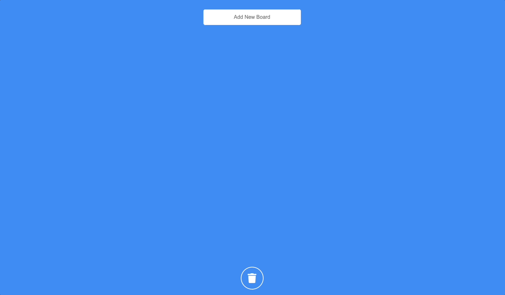

 

## Introduction

NomadCoders [React JS 마스터클래스 강의](https://nomadcoders.co/react-masterclass)를 듣고 Trello 프로젝트를 진행했습니다.

- React + TypeScript를 사용했습니다.
- 상태 관리를 위해서 Recoil을 사용했습니다.
- 드래그 앤 드롭 기능의 구현을 위해서 [react-beautiful-dnd](https://github.com/atlassian/react-beautiful-dnd) 라이브러리를 이용했습니다.
- 강의 내용의 기본 기능 외에 추가 기능을 구현했습니다.

## Trello 기본 기능

- 존재하는 board에 자유롭게 task를 추가할 수 있습니다.
- 같은 board 안에서 task를 드래그 앤 드롭을 이용해 순서를 바꿀 수 있습니다.
- 드래그 앤 드롭을 통해 task를 서로 다른 board로 이동할 수 있습니다.

## Trello 추가 기능

- 원하는 board를 직접 추가할 수 있습니다.
- board와 task에 있는 x 버튼을 통해서 삭제할 수 있습니다.
- board와 task를 휴지통 아이콘으로 드래그 앤 드롭하여 삭제할 수 있습니다.

## Link

https://2dowon.github.io/NomadCoders_Trello/
